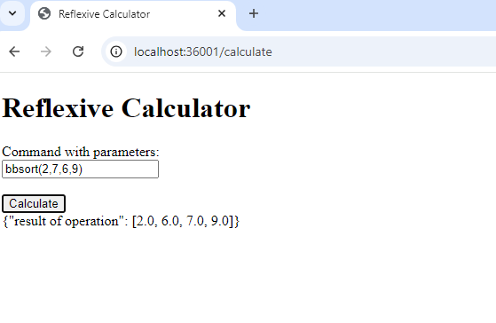
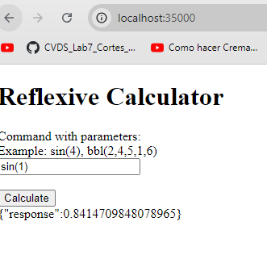

### PROYECTO PARCIAL BONO
## Descripción
Este proyecto consiste en una calculadora reflexiva que funciona a través de una arquitectura cliente-servidor. La aplicación está dividida en dos componentes principales:

CalculatorReflexServer: Un servidor Java que recibe solicitudes HTTP, ejecuta operaciones matemáticas utilizando reflexión y devuelve los resultados en formato JSON.
ServerHTTPfachada: Un servidor HTTP que actúa como fachada para el cliente. Recibe solicitudes del cliente, las reenvía al CalculatorReflexServer para su procesamiento, y devuelve la respuesta al cliente. También proporciona una interfaz web simple para interactuar con la calculadora.
Inicio
Para comenzar con el proyecto, necesitas tener Java instalado en tu sistema. Asegúrate de tener JDK 11 o superior.

### Requisitos
Java JDK 11 o superior.
Un navegador web para interactuar con la interfaz cliente.
Ejecución del Servidor Reflexivo
Compila el código:

 java -cp bin edu.escuelaing.arep.CalculatorReflexServer

 java -cp bin edu.escuelaing.arep.ServerHTTPfachada
 
El proyecto corre por el siguiente enlace
http://localhost:36001/calculate

### AUTOR jose ricardo vasquez vega
19/09/2024
